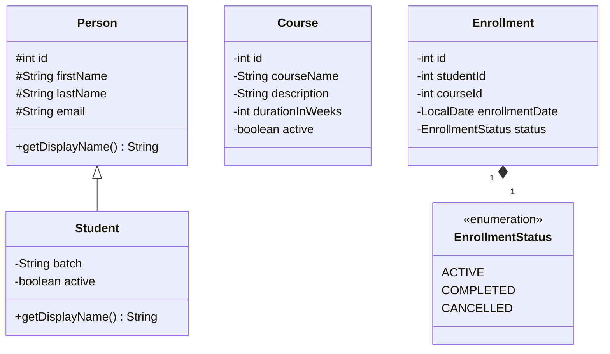

# LearnTrack - Student & Course Management System

LearnTrack is a Core Java console based application built to manage Students, Courses, and Enrollments. It leverages Object Oriented Programming (OOP) principles, Encapsulation, Inheritance, and Java Collections (ArrayList).

## Features
- **Student Management:** Add, search, view, and deactivate students.
- **Course Management:** Add, view, and toggle active status of courses.
- **Enrollment Management:** Enroll students into courses, view enrollments, and manage status (ACTIVE, COMPLETED, CANCELLED).

## Class Diagram



## Setup Instructions
Please view our detailed [Setup Instructions](docs/Setup_Instructions.md) to check your JDK and run the program.

## Architecture Notes
To read more about design choices (like ArrayList vs Arrays, use of `static`, and inheritance), please read our [Design Notes](docs/Design_Notes.md).
To review theoretical knowledge about JVM execution, read our [JVM Basics](docs/JVM_Basics.md).

## How to Run
```bash
# 1. Compile 
javac -d bin src/com/airtribe/learntrack/**/*.java src/com/airtribe/learntrack/*.java

# 2. Run
java -cp bin com.airtribe.learntrack.Main
```

## Reflections & Learnings
Building this application was a great way to solidify my Core Java concepts. While implementing `ArrayList`, I realized how much easier it is to handle dynamic data compared to standard arrays. I also grasped how `static` variables work perfectly for generating unique IDs (like `studentId`) across the whole application. 
Looking forward to refactoring this with databases and file I/O as we progress in the cohort!
